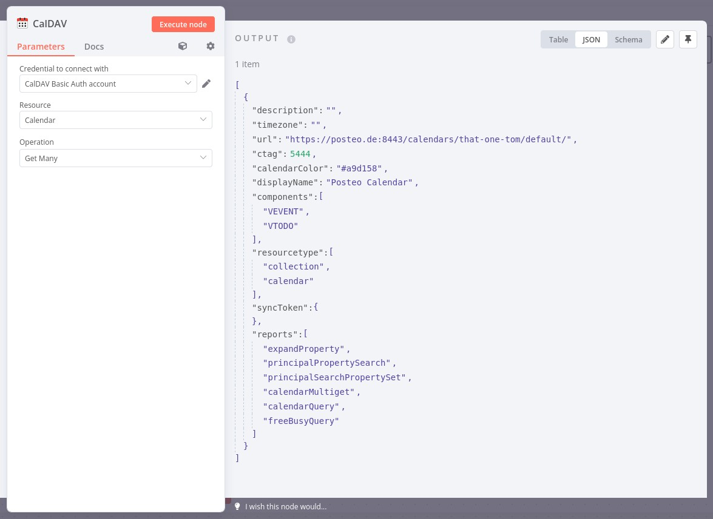

# n8n-nodes-caldav

An [n8n](https://github.com/n8n-io/n8n) node to interact with CalDAV services.

This node is currently work in progress. It's a bad idea to use it right now.

# Screenshot

# Changelog

## 0.2.2
2023-04-28

* Version bump to clean up dist folder before publishing on npm

## 0.2.1
2023-04-28

* Shut up linter

## 0.2.0
2023-04-28

* Added Events → Get Many

## 0.1.0
2023-04-28

* Added Calendar → Get Many 